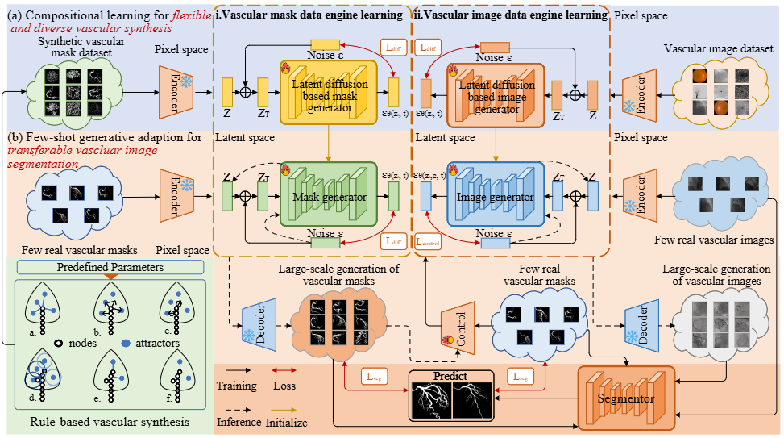

# Generative Data-engine Foundation Model for Universal Few-shot Vascular Image Segmentation

Official implementation of UniVG

[NOTE!!]The code will be gradually and continuously opened!

In this study, we propose UniVG, a novel generative foundation model for universal few-shot vascular image segmentation based on compositional learning and few-shot generative adaptation. By decomposing and recombining vascular structures with diverse backgrounds, our framework can synthesize highly realistic and diverse vessel images using minimal training data while achieving performance comparable to fully supervised approaches. UniVG has been systematically validated across 11 vascular datasets spanning five different modalities. Experimental results demonstrate its superior performance over existing methods in few-shot scenarios (using as few as five annotated images), confirming the model's excellent generalization capability and cross-domain adaptability.

